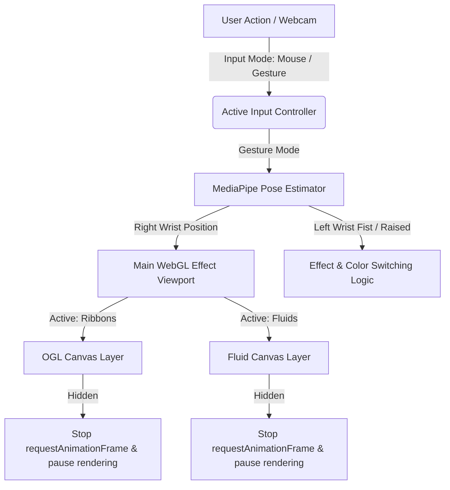

# WebGL 粒子特效与交互 HUD 设计实施规范 (复现指南)

本规范详细记录了本项目中实现的两种高性能 WebGL 鼠标/手势双交互粒子特效（**Ribbons 缎带** 与 **Fluids 雅可比流体模拟**）的设计原理、核心算法、着色器代码、以及基于 **MediaPipe Pose** 的体感控制（包括右手绘制、左手手势切换和 HUD 镜像预览）的设计实施方案，旨在方便其他 AI Agent 在其他项目中无缝复现。

---

## 目录
1. [系统整体架构与懒加载节能设计](#1-系统整体架构与懒加载节能设计)
2. [手势交互模式与 MediaPipe 追踪架构](#2-手势交互模式与-mediapipe-追踪架构)
3. [左手手势动作触发算法（防误触设计）](#3-左手手势动作触发算法防误触设计)
4. [特效一：Ribbons 缎带交互特效](#4-特效一ribbons-缎带交互特效)
5. [特效二：Fluids 雅可比流体模拟交互特效](#5-特效二fluids-雅可比流体模拟交互特效)
6. [流体“粒子永久残留不退”核心 Bug 解析与修复方案](#6-流体粒子永久残留不退核心-bug-解析与修复方案)
7. [自适应 SpaceX 风格 HUD 交互面板设计方案](#7-自适应-spacex-风格-hud-交互面板设计方案)

---

## 1. 系统整体架构与懒加载节能设计

为防止多重 WebGL 特效共存导致的 GPU/CPU 争抢与页面发热卡顿，项目采用了 **多 Canvas 解耦** 与 **资源节能暂停机制**。

### 1.1 架构拓扑


### 1.2 懒加载与能耗控制
* **0x0 像素崩溃防范**：流体 FBO 纹理延迟初始化，仅在首次切换至 Fluids 且 Canvas 尺寸有效时建立。
* **摄像头隐私与节能**：仅在 `window.controlMode === 'gesture'` 时启动 Webcam 和 MediaPipe 计算；切回鼠标模式时，自动调用 `camera.stop()` 关闭摄像头并熄灭指示灯。

---

## 2. 手势交互模式与 MediaPipe 追踪架构

本系统引入了 `@mediapipe/pose` 进行姿态估计，将右手腕（Landmark 16）作为主坐标输入，驱动 WebGL 特效在空中流动。

### 2.1 镜像渲染与骨骼线叠加
1. 捕获到的摄像头画面通过 2D Canvas 进行镜像翻转，提供直观的镜面反向操控感：
   ```javascript
   ctx.translate(canvasWidth, 0);
   ctx.scale(-1, 1);
   ctx.drawImage(videoFrame, 0, 0, width, height);
   ```
2. 绘制简易的半透明绿色骨骼线：把主要的全身 landmark 坐标按 `(1.0 - landmark.x) * canvasWidth` 换算并连成绿线。
3. 对右肩 (12) 用亮绿点圈注，对右手腕 (16) 使用红色发光圈和准心追踪高亮标出。

### 2.2 坐标插值平滑机制 (Lerp)
为消除因摄像头噪点造成的手指坐标抖动，使用指数缓动对每一帧坐标执行阻尼插值：
\[
X_{\text{smooth}} = X_{\text{smooth}} + (X_{\text{target}} - X_{\text{smooth}}) \times 0.18
\]
\[
Y_{\text{smooth}} = Y_{\text{smooth}} + (Y_{\text{target}} - Y_{\text{smooth}}) \times 0.18
\]
平滑后的坐标将被映射为 WebGL 特效的 `texcoordX`/`texcoordY` 输入，并模拟持续滑动的拖尾行为。

---

## 3. 左手手势动作触发算法（防误触设计）

在进行右手空中绘图时，利用**左手腕（Landmark 15）**的特定姿态，执行特效与色彩预设的快速切换。为了在大范围手臂移动中排除误触，设计了以下基于 Pose 自带关键点距离缩放的物理算法：

### 3.1 握拳判定与双肩距归一化（切 EFFECT 模式）
* **原理**：人体离镜头的距离会直接改变图像中的像素距离。为保证在远/近处都能准确判定，算法将**双肩之间的像素距离**作为归一化基准（分母）。
* **判定参数**：
  * 左肩：\(P_{11}\)，右肩：\(P_{12}\)，左手腕：\(P_{15}\)，左小指尖：\(P_{17}\)，左食指尖：\(P_{19}\)。
  * 双肩基准距离：\(D_{\text{shoulder}} = \text{dist3D}(P_{11}, P_{12})\)。
  * 手指平均伸展距离：\(D_{\text{hand}} = \frac{\text{dist3D}(P_{15}, P_{17}) + \text{dist3D}(P_{15}, P_{19})}{2.0}\)。
  * 伸展比率：\(R_{\text{hand}} = \frac{D_{\text{hand}}}{D_{\text{shoulder}}}\)。
* **逻辑触发**：
  * 左手腕必须高于左跨（即左手抬起）。
  * 当 \(R_{\text{hand}} < 0.11\)（指尖向手腕蜷缩）时，判定为**“握拳”**。
  * **防抖边缘触发（Edge Trigger）**：只有从“张开”切换为“握拳”的一瞬间触发一次 `EFFECT` 循环切换。必须先张开手才能发起下一次切换。

### 3.2 高举张手悬停判定（切 COLOR PRESET）
* **逻辑触发**：
  * 左手抬起且高于左肩（\(P_{15}.y < P_{11}.y\)）。
  * 保持手掌张开（\(R_{\text{hand}} > 0.14\)）。
  * **悬停加载机制 (Hover Hold)**：满足上述状态时，在 Canvas 左手腕坐标处绘制绿色圆环进度条（Loading Ring）。当在区域内**连续停留保持满 1.0 秒**，累加进度达 100% 后触发 `COLOR PRESET` 切换，并进入锁定状态。只有当手放下或移开判定区时才会重置并解锁，彻底避免连续切换。

---

## 4. 特效一：Ribbons 缎带交互特效

Ribbon 特效使用轻量级 WebGL 库 **OGL**。它通过跟随手势点轨迹生成动态三角网格（Polyline），并采用阻尼弹簧算法与顶点着色器正弦波模拟出飘逸的丝绸质感。

### 4.1 核心着色器设计

#### 顶点着色器 (Vertex Shader)
```glsl
attribute vec3 position;
attribute vec2 uv;
varying vec2 vUV;
uniform float uTime;
uniform float uEnableShaderEffect;

void main() {
    vUV = uv;
    vec3 pos = position;
    if (uEnableShaderEffect > 0.5) {
        pos.x += sin(uv.y * 10.0 + uTime * 2.0) * 0.05;
        pos.y += cos(uv.y * 8.0 + uTime * 1.5) * 0.03;
    }
    gl_Position = vec4(pos, 1.0);
}
```

#### 片段着色器 (Fragment Shader)
```glsl
precision mediump float;
varying vec2 vUV;
uniform vec3 uColor;
uniform float uEnableFade;

void main() {
    float alpha = 1.0;
    if (uEnableFade > 0.5) {
        alpha = 1.0 - smoothstep(0.0, 1.0, vUV.y);
    }
    gl_FragColor = vec4(uColor * alpha, alpha);
}
```

---

## 5. 特效二：Fluids 雅可比流体模拟交互特效

流体特效是基于二维**纳维-斯托克斯方程 (Navier-Stokes Equations)** 简化的离散数值模拟。

### 5.1 Advection (平流) 衰减着色器
```glsl
precision highp float;
precision highp sampler2D;
varying vec2 vUv;
uniform sampler2D uVelocity;
uniform sampler2D uSource;
uniform vec2 texelSize;
uniform vec2 dyeTexelSize;
uniform float dt;
uniform float dissipation;

void main () {
    vec2 coord = vUv - dt * texture2D(uVelocity, vUv).xy * texelSize;
    vec4 result = texture2D(uSource, coord);
    float decay = 1.0 + dissipation * dt;
    gl_FragColor = result / decay;
}
```

### 5.2 PARTICLES TIME 时间映射公式
为了获得直观的生存时间映射（单位：秒，范围：`0.5s - 5.0s`），使用反比例公式：
\[
\text{DENSITY\_DISSIPATION} = \frac{10.0}{\text{ParticlesTime(s)}}
\]

---

## 6. 流体“粒子永久残留不退”核心 Bug 解析与修复方案

### 6.1 Bug 成因分析
流体混合机制使用 `gl.blendFunc(gl.ONE, gl.ONE_MINUS_SRC_ALPHA)`，在将衰减后的帧 blit 绘制到屏幕 Canvas 之前，**没有清空默认的帧缓存区颜色附件**。导致上一帧的像素颜色被永久锁死留在 Canvas 的硬件缓冲区中。

### 6.2 修复代码实现
在 blit 输出到 canvas 前强行调用 `clear` 标志位擦除历史像素：
```javascript
drawDisplay(target) {
    this.displayMaterial.bind();
    gl.uniform1i(this.displayMaterial.uniforms.uTexture, this.dye.read.attach(0));
    // 强制执行透明清屏 (clear = true)
    this.blit(target, true); 
}
```

---

## 7. 自适应 SpaceX 风格 HUD 交互面板设计方案

* **双行页眉布局**：首行摆放标题与折叠键，次行摆放 EFFECT 切换、INPUT MODE 控制模式与主题预设（COLOR PRESET）按钮组。
* **对称居中响应式网格**：
  ```css
  .settings-subgrid {
    display: grid;
    grid-template-columns: repeat(3, 1fr);
    gap: 16px;
    width: 100%;
    max-width: 960px;
    margin: 0 auto;
  }
  ```
  该媒体查询在 `900px` 时缩至 2 列（`max-width: 640px`），`600px` 时缩至 1 列（`max-width: 320px`），完美实现各端自适应。
