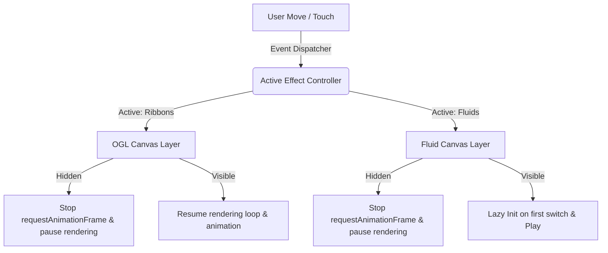

# WebGL 粒子特效与交互 HUD 设计实施规范 (复现指南)

本规范详细记录了本项目中实现的两种高性能 WebGL 鼠标交互粒子特效（**Ribbons 缎带** 与 **Fluids 雅可比流体模拟**）的设计原理、核心算法、着色器代码、自适应 HUD 交互面板的设计方案，以及在开发中沉淀的关键 Bug 修复经验（如 WebGL 混合叠加残留问题），旨在方便其他 AI Agent 在其他项目中无缝复现。

---

## 目录
1. [系统整体架构与懒加载节能设计](#1-系统整体架构与懒加载节能设计)
2. [特效一：Ribbons 缎带交互特效](#2-特效一ribbons-缎带交互特效)
3. [特效二：Fluids 雅可比流体模拟交互特效](#3-特效二fluids-雅可比流体模拟交互特效)
4. [流体“粒子永久残留不退”核心 Bug 解析与修复方案](#4-流体粒子永久残留不退核心-bug-解析与修复方案)
5. [自适应 SpaceX 风格 HUD 交互面板设计方案](#5-自适应-spacex-风格-hud-交互面板设计方案)

---

## 1. 系统整体架构与懒加载节能设计

为防止多重 WebGL 特效共存导致的 GPU/CPU 争抢与页面发热卡顿，项目采用了 **双 Canvas 解耦** 与 **资源节能暂停机制**。

### 1.1 架构拓扑


### 1.2 懒加载防崩与生命周期管理
* **0x0 像素崩溃防范**：由于未激活的 WebGL Canvas 在 CSS 中被设置为 `display: none`，初始宽高为 0。如果在此状态下初始化并分配帧缓存区（Framebuffers），WebGL 纹理分配逻辑会抛出 `0x0` 非法尺寸错误导致上下文崩溃。
* **延迟实例化**：流体特效（Fluids）在页面加载时处于非活动状态，采用懒加载机制。只有当用户在控制台首次切换到 `FLUIDS`（此时画布已被设为 `display: block`）时，才触发实例化：
  ```javascript
  // 切换逻辑示例
  if (effectName === 'fluids') {
      ribbonsApp.pause();
      ribbonCanvas.style.display = 'none';
      fluidCanvas.style.display = 'block';
      
      if (!fluidAppInstance) {
          fluidAppInstance = new FluidApp(); // 懒加载实例化
      }
      fluidAppInstance.resume();
  }
  ```

---

## 2. 特效一：Ribbons 缎带交互特效

Ribbon 特效使用轻量级 WebGL 库 **OGL**（通过 ESM 模块加载）。它通过跟随鼠标路径生成动态三角网格（Polyline），并采用阻尼弹簧算法与顶点着色器正弦波模拟出飘逸的丝绸质感。

### 2.1 阻尼弹簧跟随算法
为了让缎带具有平滑自然的物理惯性，鼠标轨迹点并非直接传递给网格，而是通过以下弹簧插值公式计算：
\[
v(t) = v(t-1) \cdot \text{friction} + (p_{\text{mouse}} - p_{\text{ribbon}}) \cdot \text{spring}
\]
\[
p_{\text{ribbon}}(t) = p_{\text{ribbon}}(t-1) + v(t)
\]

### 2.2 核心着色器设计

#### 顶点着色器 (Vertex Shader)
在顶点着色器中注入时间变量，通过正弦波实现缎带的动态波动（Wave deformation）：
```glsl
attribute vec3 position;
attribute vec2 uv;
varying vec2 vUV;
uniform float uTime;
uniform float uEnableWaves;

void main() {
    vUV = uv;
    vec3 pos = position;
    if (uEnableWaves > 0.5) {
        // 利用正弦波与沿带长度方向的 uv.y 对顶点位置进行横向蠕动偏移
        pos.x += sin(uv.y * 10.0 + uTime * 2.0) * 0.05;
        pos.y += cos(uv.y * 8.0 + uTime * 1.5) * 0.03;
    }
    gl_Position = vec4(pos, 1.0);
}
```

#### 片段着色器 (Fragment Shader)
根据生命周期和淡出设置渲染缎带颜色，支持沿长度方向的透明度线性渐变：
```glsl
precision mediump float;
varying vec2 vUV;
uniform vec3 uColor;
uniform float uEnableFade;

void main() {
    float alpha = 1.0;
    if (uEnableFade > 0.5) {
        // 头端最亮，尾端渐变模糊消失
        alpha = 1.0 - smoothstep(0.0, 1.0, vUV.y);
    }
    gl_FragColor = vec4(uColor * alpha, alpha);
}
```

### 2.3 参数面板映射表
| 前端参数名称 | 滑块范围 | 对应 JS 变量 / Uniform | 视觉影响说明 |
| :--- | :--- | :--- | :--- |
| **RIBBON COUNT** | 1 - 10 | `this.config.count` | 缎带条数，生成时通过配色组色值自动插值着色 |
| **THICKNESS** | 5 - 100 | `this.config.thickness` | 缎带网格的基础线宽（像素） |
| **SPEED** | 0.1 - 2.0 | `this.config.speed` | 弹簧插值阻尼，值越小惯性跟随越慢 |
| **MAX AGE** | 100 - 2000 | `this.config.maxAge` | 网格节点的存活寿命（毫秒），决定拖尾长度 |
| **ENABLE FADE** | 开关 (Boolean) | `uEnableFade` (Uniform) | 是否开启随长度渐变消失的淡出效果 |
| **ENABLE WAVES** | 开关 (Boolean) | `uEnableWaves` (Uniform)| 是否开启顶点正弦波变形，产生水波状蠕动 |

---

## 3. 特效二：Fluids 雅可比流体模拟交互特效

流体特效是基于二维**纳维-斯托克斯方程 (Navier-Stokes Equations)** 简化的数值模拟。流体被存储在两组交替读写的双缓冲区双帧缓存（Double Framebuffer Objects, Double FBO）中：一组记录速度场（Velocity FBO），一组记录密度/颜色场（Dye FBO）。

### 3.1 雅可比迭代核心物理步骤
每一帧的物理模拟包含以下四个数学步骤：
1. **Advection (平流)**：根据当前的速度场运送流体自身的量（速度和密度）。
2. **Splat (溅射)**：当鼠标移动或触碰时，在指定坐标的邻域注入新的速度增量和染料密度。
3. **Divergence & Curl (散度与旋度)**：计算速度场的散度（Divergence），用于求解压力；计算旋度（Curl），用于流体涡度局域化，产生旋涡湍流细节。
4. **Pressure Jacobi Solver (雅可比求解器)**：解离散的泊松方程，计算出压力场，以消除发散并使速度场无散（无压缩流体）。
5. **Gradient Subtract (梯度相减)**：从速度场中减去压力梯度，获得满足物理连续性方程的无散速度场。

### 3.2 核心着色器源码

#### A. Advection 着色器
负责流体的物理平流推进，并执行消散衰减（Dissipation）：
```glsl
precision highp float;
precision highp sampler2D;
varying vec2 vUv;
uniform sampler2D uVelocity;
uniform sampler2D uSource;
uniform vec2 texelSize;
uniform vec2 dyeTexelSize;
uniform float dt;
uniform float dissipation;

vec4 bilerp (sampler2D sam, vec2 uv, vec2 tsize) {
    vec2 st = uv / tsize - 0.5;
    vec2 iuv = floor(st);
    vec2 fuv = fract(st);

    vec4 a = texture2D(sam, (iuv + vec2(0.5, 0.5)) * tsize);
    vec4 b = texture2D(sam, (iuv + vec2(1.5, 0.5)) * tsize);
    vec4 c = texture2D(sam, (iuv + vec2(0.5, 1.5)) * tsize);
    vec4 d = texture2D(sam, (iuv + vec2(1.5, 1.5)) * tsize);

    return mix(mix(a, b, fuv.x), mix(c, d, fuv.x), fuv.y);
}

void main () {
    // 逆向平流采样 (Semi-Lagrangian Advection)
    vec2 coord = vUv - dt * texture2D(uVelocity, vUv).xy * texelSize;
    vec4 result = texture2D(uSource, coord);
    // 指数消散因子计算
    float decay = 1.0 + dissipation * dt;
    gl_FragColor = result / decay;
}
```

#### B. Splat (鼠标溅射注入) 着色器
```glsl
precision highp float;
precision highp sampler2D;
varying vec2 vUv;
uniform sampler2D uTarget;
uniform float aspectRatio;
uniform vec3 color;
uniform vec2 point;
uniform float radius;

void main () {
    vec2 p = vUv - point;
    p.x *= aspectRatio;
    // 高斯溅射核函数注入
    vec3 splat = exp(-dot(p, p) / radius) * color;
    vec3 base = texture2D(uTarget, vUv).xyz;
    gl_FragColor = vec4(base + splat, 1.0);
}
```

### 3.3 参数映射与关键换算公式

为了让物理参数“消散率”更具用户友好度，前端滑块被设计为 **PARTICLES TIME (秒)**，表示粒子在屏幕上的可见存活时长，然后在后台使用反比例换算公式将其映射为 WebGL 中的指数消散衰减系数 `DENSITY_DISSIPATION`。

#### 时间换算公式
为了获得直观的生存时间映射（在 60FPS 下，在 `0.5s - 5.0s` 范围内合理退去），使用反比例公式：
\[
\text{DENSITY\_DISSIPATION} = \frac{10.0}{\text{ParticlesTime(s)}}
\]

* **例如**：当 `Particles Time` 设定为完美预设值 `2.8s` 时，后台转换得到的消散率变量为：
  `DENSITY_DISSIPATION = 10.0 / 2.8 = 3.5714`

| 前端参数名称 | 滑块范围 | 对应 JS 变量 / Uniform | 物理原理与视觉说明 |
| :--- | :--- | :--- | :--- |
| **FLUID CURL** | 0.5 - 10.0 | `this.config.CURL` | 流体旋度，引入涡度局域化修正力，值越大湍流细节越繁多 |
| **SPLAT RADIUS** | 0.05 - 0.8 | `this.config.SPLAT_RADIUS` | 溅射核半径，控制鼠标一次划过激起的流体范围大小 |
| **VELOCITY DISSIPATION** | 0.5 - 5.0 | `this.config.VELOCITY_DISSIPATION` | 动能流速消散率，值越小流体流动得越远、波纹流动得越持久 |
| **PARTICLES TIME** | 0.5s - 5.0s | `this.config.DENSITY_DISSIPATION` | **颜色消散率换算**，控制粒子的存活时间。公式如上所示 |
| **RAINBOW MODE** | 开关 (Boolean) | `this.config.RAINBOW_MODE` | 勾选时开启色彩彩虹色谱循环；关闭时使用主题色预设 |
| **FLUID SHADING** | 开关 (Boolean) | `this.config.SHADING` | 法线反向高光凹凸映射（Normal-mapping Shading），增加流体的 3D 浮雕光影油质感 |

---

## 4. 流体“粒子永久残留不退”核心 Bug 解析与修复方案

在开发流体特效时，曾遭遇即使停止滑动鼠标、或使用 `RESET ENGINE` 将消散时间归零，**流体粒子依然五彩斑斓地堆满整个屏幕且永久无法消散**的严重渲染 Bug。

### 4.1 Bug 成因分析
此 Bug 的核心在于 WebGL **画布混合（WebGL Blend）** 与 **默认帧缓冲区清除（Framebuffer Clear）** 的协作失效：
1. 流体应用的 Canvas 是独立透明叠层。它的 WebGL 上下文启用了混合机制：
   ```javascript
   gl.blendFunc(gl.ONE, gl.ONE_MINUS_SRC_ALPHA);
   gl.enable(gl.BLEND);
   ```
2. 在渲染循环中，程序会将已在双 FBO 中平流消散衰减后的纹理（`dye.read`）绘制到默认的屏幕缓冲区（`target = null`）：
   ```javascript
   this.blit(target);
   ```
3. **关键缺失**：在每次 `blit(target)` 绘制前，**没有清空默认屏幕帧缓冲区（Canvas）的颜色附件**。
4. **数学级混合堆积**：
   在没有 `clear` 的情况下，上一帧绘制的像素值会被留在 canvas 硬件缓存中。
   假设上一帧留存的像素颜色为 `C_old`。在下一帧，即使我们在 FBO 中经过雅可比平流消散，流体纹理已经几乎衰减为完全透明 `(0, 0, 0, 0)`。
   根据混合方程进行物理渲染：
   \[
   C_{\text{final}} = C_{\text{new}} \cdot 1 + C_{\text{old}} \cdot (1 - \alpha_{\text{new}})
   \]
   由于流体纹理已退化消逝，\(C_{\text{new}} \to 0\) 且 \(\alpha_{\text{new}} \to 0\)：
   \[
   C_{\text{final}} = 0 \cdot 1 + C_{\text{old}} \cdot (1 - 0) = C_{\text{old}}
   \]
   由此可见，混合计算使得**屏幕上的像素完全继承了历史帧留存的色值，流体颜色彻底被“锁死”在屏幕上永久不褪色**。随着鼠标不断晃动，历史帧的颜色不断堆积叠加，最终染满整个屏幕。

### 4.2 修复代码实现
解决方案是在每一帧将渲染结果输出至 Canvas 视口前，强制擦除清空前一帧残留的颜色附件：
```javascript
// 在 drawDisplay(target) 方法中，调用 blit 输出到 canvas 前传入 clear 标志位为 true
drawDisplay(target) {
    const gl = this.gl;
    let width = target == null ? gl.drawingBufferWidth : target.width;
    let height = target == null ? gl.drawingBufferHeight : target.height;
    
    this.displayMaterial.bind();
    if (this.config.SHADING) {
        gl.uniform2f(this.displayMaterial.uniforms.texelSize, 1.0 / width, 1.0 / height);
    }
    gl.uniform1i(this.displayMaterial.uniforms.uTexture, this.dye.read.attach(0));
    
    // 关键修正：传入 true 激活清除命令
    this.blit(target, true); 
}

// 对应的 blit 实现
this.blit = (target, clear = false) => {
    if (target == null) {
        gl.viewport(0, 0, gl.drawingBufferWidth, gl.drawingBufferHeight);
        gl.bindFramebuffer(gl.FRAMEBUFFER, null);
    } else {
        gl.viewport(0, 0, target.width, target.height);
        gl.bindFramebuffer(gl.FRAMEBUFFER, target.fbo);
    }
    // 强制执行透明清屏，清除历史残留混合像素
    if (clear) {
        gl.clearColor(0.0, 0.0, 0.0, 0.0);
        gl.clear(gl.COLOR_BUFFER_BIT);
    }
    gl.drawElements(gl.TRIANGLES, 6, gl.UNSIGNED_SHORT, 0);
};
```

---

## 5. 自适应 SpaceX 风格 HUD 交互面板设计方案

整个参数控制面板采用了 SpaceX 的科幻极简主义暗黑（Aero-Telemetry）设计。

### 5.1 双行页眉结构（防止遮挡冲突）
页眉被划分为两个水平 Flex 行，以确保在宽/窄视口下，各操作按钮不会发生垂直重叠。
* **Row 1**：左侧摆放大写加粗的 `SYSTEM CUSTOMIZE` 控制台大标题，右侧摆放扁平胶囊状的 `COLLAPSE ▼` 面板伸缩触发键。
* **Row 2**：左侧为 `EFFECT` 模式选择区（扁平半透明按钮），右侧为 `COLOR PRESET` 主题色胶囊键（Falcon Heavy 紫粉、Starlink 蓝青、Dragon 红橙、Super Heavy 金）。

### 5.2 对称居中响应式网格 (Grid Columns)
控制参数项（卡片）并没有直接平铺至大屏边缘（会造成卡片过度扁平拉伸，降低专业感），也没有缩在一侧（失去对称美），而是设计了带有最大宽度限制的自适应响应式网格布局。

#### 核心 CSS 布局代码 (styles.css)
```css
/* 参数子网格容器 */
.settings-subgrid {
  display: grid;
  grid-template-columns: repeat(3, 1fr); /* 大屏下 3 列排布 */
  gap: 16px;
  width: 100%;
  max-width: 960px; /* 完美的黄金宽高比例限制 */
  margin: 0 auto;   /* 水平对齐居中 */
}

/* 针对中等屏幕（平板电脑或小屏笔记本） */
@media (max-width: 900px) {
  .settings-subgrid {
    grid-template-columns: repeat(2, 1fr); /* 切换为 2 列排布 */
    max-width: 640px;
  }
}

/* 针对移动端窄屏 */
@media (max-width: 600px) {
  .settings-subgrid {
    grid-template-columns: 1fr;            /* 切换为 1 列排布 */
    max-width: 320px;
  }
}
```

### 5.3 按钮穿透对齐技术（防 checkbox 越界）
HUD 的开关控制器使用 `<input type="checkbox">` 配合 `.switch-slider` 实现科技风滑钮。为了使卡片在 Flex 盒模型中能横向两端对齐，并且防止文字和开关球发生折行挤压，采用了如下对齐策略：
```css
.control-group.toggle-group {
  display: flex;
  flex-direction: row;
  justify-content: space-between;
  align-items: center;
  padding: 12px 20px;
}

/* 让实际的隐藏 checkbox 绝对定位脱离排版流，点击事件穿透 */
.hud-switch input {
  position: absolute;
  opacity: 0;
  width: 0;
  height: 0;
  pointer-events: none;
}
```
通过上述处理，完美实现了无论卡片文字长度如何，左端文字与右端开关滑钮永远维持极致对齐的科幻美感。
